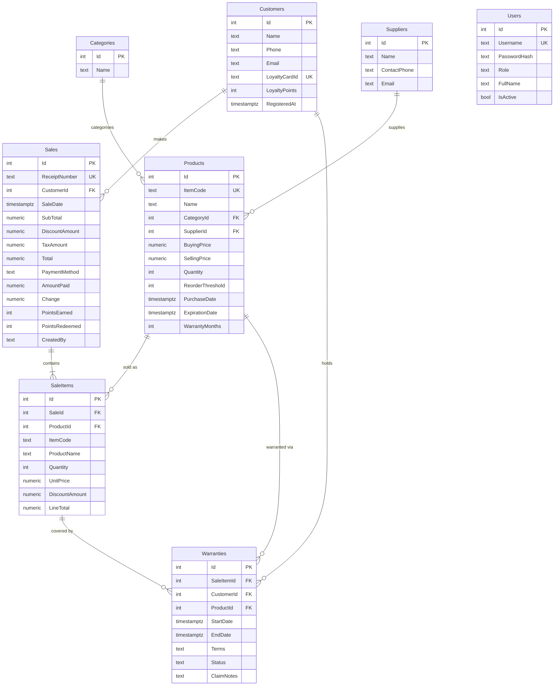
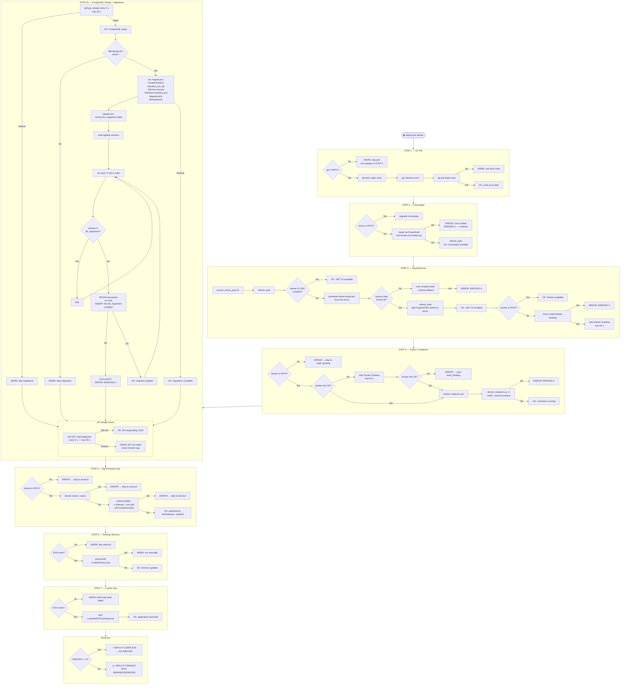

# LasanthaPOS — System Design Document

> Version: 1.0 · Updated: 2026-04-05

---

## Table of Contents

1. [System Overview](#1-system-overview)
2. [Full System Architecture](#2-full-system-architecture)
3. [Layer Descriptions](#3-layer-descriptions)
4. [Desktop Application Structure](#4-desktop-application-structure)
5. [API Structure](#5-api-structure)
6. [Database Schema](#6-database-schema)
7. [Domain Model Relationships](#7-domain-model-relationships)
8. [API Endpoints](#8-api-endpoints)
9. [Database Migration Architecture](#9-database-migration-architecture)
10. [Deploy Pipeline Flow](#10-deploy-pipeline-flow)
11. [Key Business Flows](#11-key-business-flows)

---

## 1. System Overview

LasanthaPOS is a single-machine Point of Sale system for a retail shop. It uses a three-tier architecture:

| Tier       | Technology                   | Runtime            | Port  |
|------------|------------------------------|--------------------|-------|
| Desktop UI | C# WPF (.NET 10)             | Windows host       | —     |
| API        | ASP.NET Core Web API (.NET 10) | Docker container | 5100  |
| Database   | PostgreSQL 16                | Docker container   | 5432  |

The desktop app communicates with the API exclusively over HTTP/REST on `localhost`. The API owns all business logic and data access; the desktop is a pure presentation layer.

---

## 2. Full System Architecture

```
┌─────────────────────────────────────────────────────────────────────────────┐
│                              Windows Host Machine                           │
│                                                                             │
│  ┌────────────────────────────────────────┐                                 │
│  │        WPF Desktop Application         │                                 │
│  │           (LasanthaPOS.Desktop)        │                                 │
│  │                                        │                                 │
│  │  ┌──────────┐  ┌──────────────────┐   │                                 │
│  │  │  Views   │  │   ApiService.cs  │   │                                 │
│  │  │ (XAML)   │◄─┤  (HttpClient)    │   │                                 │
│  │  │          │  │                  │   │                                 │
│  │  │ Login    │  │  HTTP/REST       │   │                                 │
│  │  │ POS      │  │  JSON payloads   │   │                                 │
│  │  │ Inventory│  │                  │   │                                 │
│  │  │ Customers│  └─────────┬────────┘   │                                 │
│  │  │ Warranty │            │            │                                 │
│  │  │ Reports  │            │            │                                 │
│  │  └──────────┘            │            │                                 │
│  └──────────────────────────┼────────────┘                                 │
│                             │ HTTP :5100                                    │
│                             │                                               │
│  ┌──────────────────────────▼──────────────────────────────────────────┐   │
│  │                      Docker Engine                                  │   │
│  │                                                                     │   │
│  │  ┌──────────────────────────────────────┐   ┌──────────────────┐   │   │
│  │  │      lasantha_pos_api  (:8080)        │   │ lasantha_pos_db  │   │   │
│  │  │   ASP.NET Core Web API (.NET 10)      │   │  PostgreSQL 16   │   │   │
│  │  │                                      │   │                  │   │   │
│  │  │  Controllers:                        │   │  Tables:         │   │   │
│  │  │  ├─ AuthController                   │   │  ├─ Users        │   │   │
│  │  │  ├─ ProductsController               │   │  ├─ Categories   │   │   │
│  │  │  ├─ SalesController                  │◄──┤  ├─ Suppliers    │   │   │
│  │  │  └─ CustomerAndOtherControllers      │   │  ├─ Products     │   │   │
│  │  │                                      │   │  ├─ Customers    │   │   │
│  │  │  Data:                               │   │  ├─ Sales        │   │   │
│  │  │  └─ AppDbContext (EF Core)           │   │  ├─ SaleItems    │   │   │
│  │  │                                      │   │  └─ Warranties   │   │   │
│  │  │  Port mapping: 5100 → 8080           │   │                  │   │   │
│  │  └──────────────────────────────────────┘   │  Port: 5432      │   │   │
│  │                    depends_on (healthy)      └──────────────────┘   │   │
│  │                                                                     │   │
│  │  Volumes:  pgdata (DB data)   api_logs (Serilog logs)               │   │
│  └─────────────────────────────────────────────────────────────────────┘   │
│                                                                             │
│  Deploy tooling (runs on host):                                             │
│  ├─ deploy.bat        — full deploy pipeline                                │
│  ├─ build-frontend.bat — desktop-only rebuild                               │
│  └─ db/migrate.ps1   — SQL migration runner                                 │
└─────────────────────────────────────────────────────────────────────────────┘
```

---

## 3. Layer Descriptions

### Desktop (WPF)
- **Framework:** .NET 10, WPF (Windows Presentation Foundation)
- **Pattern:** Code-behind with a shared `ApiService` HTTP wrapper
- **Communication:** All data access via `HttpClient` calls to the API; no direct DB access
- **Session state:** Login response (username, role) held in memory for the session
- **Publish target:** `win-x64`, self-contained = false (depends on .NET runtime)

### API (ASP.NET Core)
- **Framework:** .NET 10, ASP.NET Core minimal hosting model
- **ORM:** Entity Framework Core 10 with Npgsql provider
- **Logging:** Serilog — console + rolling file (`/app/logs/api-*.log`)
- **Auth:** BCrypt password hashing; JWT not yet implemented
- **Migrations:** `db.Database.Migrate()` runs automatically on startup
- **CORS:** AllowAnyOrigin (development posture — tighten for production)

### Database (PostgreSQL 16)
- **Container:** `postgres:16-alpine`
- **Credentials:** `posuser / pospassword123` (override via env vars for production)
- **Schema managed by:** EF Core migrations + versioned SQL scripts (`db/migrate.ps1`)
- **Health check:** `pg_isready` polled every 10 s; API container waits for healthy status

---

## 4. Desktop Application Structure

```
LasanthaPOS.Desktop/
├── App.xaml(.cs)                   Application entry point, startup config
├── MainWindow.xaml(.cs)            Shell window with navigation frame
├── Models/                         Client-side DTOs (mirroring API models)
├── Services/
│   └── ApiService.cs               Central HttpClient wrapper (all API calls)
└── Views/
    ├── LoginWindow.xaml(.cs)       Authentication screen
    ├── InventoryPage.xaml(.cs)     Product CRUD, search, import/export
    ├── PosPage.xaml(.cs)           Checkout, cart, payment, receipt print
    ├── CustomersPage.xaml(.cs)     Customer register, loyalty points
    ├── WarrantyPage.xaml(.cs)      Warranty lookup and claim management
    ├── ReportPage.xaml(.cs)        Daily sales summary
    ├── ProductDialog.xaml(.cs)     Add/edit product modal
    ├── CustomerDialog.xaml(.cs)    Add/edit customer modal
    └── CategoriesSuppliersDialog.xaml(.cs)  Manage categories & suppliers
```

### Navigation Flow

```
LoginWindow
    │
    └──► MainWindow (shell)
             ├── InventoryPage    [Admin / Manager / Cashier]
             ├── PosPage          [Admin / Manager / Cashier]
             ├── CustomersPage    [Admin / Manager / Cashier]
             ├── WarrantyPage     [Admin / Manager / Cashier]
             └── ReportPage       [Admin / Manager]
```

---

## 5. API Structure

```
LasanthaPOS.API/
├── Program.cs                      Host bootstrap, DI, middleware, auto-migrate, seed
├── appsettings.json                Connection string, logging config
├── Models/
│   └── Models.cs                   All domain models (8 entities)
├── Data/
│   └── AppDbContext.cs             EF Core DbContext, DbSets, fluent config
├── Migrations/
│   ├── 20260403164529_InitialCreate.cs
│   └── AppDbContextModelSnapshot.cs
└── Controllers/
    ├── AuthController.cs           POST /api/auth/login
    ├── ProductsController.cs       Full CRUD + search + low-stock
    ├── SalesController.cs          Sale recording + daily summary
    └── CustomerAndOtherControllers.cs  Customers, Warranties, Categories, Suppliers
```

---

## 6. Database Schema

```
┌─────────────┐         ┌──────────────────────────────────────────────────┐
│  Categories │         │                    Products                      │
│─────────────│         │──────────────────────────────────────────────────│
│ Id (PK)     │◄────────│ Id (PK)                                          │
│ Name        │         │ ItemCode (UNIQUE)                                 │
└─────────────┘         │ Name                                             │
                        │ CategoryId (FK → Categories)                     │
┌─────────────┐         │ SupplierId (FK → Suppliers)                      │
│  Suppliers  │         │ BuyingPrice / SellingPrice                       │
│─────────────│◄────────│ Quantity / ReorderThreshold                      │
│ Id (PK)     │         │ PurchaseDate / ExpirationDate / WarrantyMonths   │
│ Name        │         └──────────────────┬───────────────────────────────┘
│ContactPhone │                            │
│ Email       │         ┌──────────────────▼───────────────────────────────┐
└─────────────┘         │                  SaleItems                       │
                        │──────────────────────────────────────────────────│
┌─────────────┐         │ Id (PK)                                          │
│  Customers  │         │ SaleId (FK → Sales)                              │
│─────────────│         │ ProductId (FK → Products)                        │
│ Id (PK)     │         │ ItemCode / ProductName (snapshot at time of sale)│
│ Name        │         │ Quantity / UnitPrice / DiscountAmount / LineTotal │
│ Phone/Email │◄──┐     └──────────────┬───────────────────────────────────┘
│LoyaltyCardId│   │                    │
│LoyaltyPoints│   │     ┌──────────────▼───────────────────────────────────┐
│ RegisteredAt│   │     │                   Warranties                     │
└──────┬──────┘   │     │──────────────────────────────────────────────────│
       │          │     │ Id (PK)                                          │
       │          │     │ SaleItemId (FK → SaleItems)                      │
       ▼          │     │ CustomerId (FK → Customers)                      │
┌─────────────┐   │     │ ProductId  (FK → Products)                       │
│    Sales    │   │     │ StartDate / EndDate                              │
│─────────────│   │     │ Terms / Status / ClaimNotes                      │
│ Id (PK)     │   └─────└──────────────────────────────────────────────────┘
│ReceiptNumber│
│ CustomerId  │         ┌──────────────────────────────────────────────────┐
│ SaleDate    │         │                    Users                         │
│ SubTotal    │         │──────────────────────────────────────────────────│
│DiscountAmt  │         │ Id (PK)                                          │
│ TaxAmount   │         │ Username (UNIQUE)                                 │
│ Total       │         │ PasswordHash (BCrypt)                            │
│PaymentMethod│         │ Role  [Admin | Manager | Cashier]                │
│ AmountPaid  │         │ FullName / IsActive                              │
│ Change      │         └──────────────────────────────────────────────────┘
│ PointsEarned│
│PointsRedeem │
│ CreatedBy   │
└─────────────┘
```

---

## 7. Domain Model Relationships



---

## 8. API Endpoints

| Method | Route                          | Description                              |
|--------|--------------------------------|------------------------------------------|
| POST   | `/api/auth/login`              | Verify credentials, return user info     |
| GET    | `/api/products`                | List all products                        |
| GET    | `/api/products/{id}`           | Get single product                       |
| GET    | `/api/products/search?q=`      | Search by name or item code              |
| GET    | `/api/products/low-stock`      | Products at or below reorder threshold   |
| POST   | `/api/products`                | Create product                           |
| PUT    | `/api/products/{id}`           | Update product                           |
| DELETE | `/api/products/{id}`           | Delete product                           |
| GET    | `/api/sales`                   | List all sales                           |
| GET    | `/api/sales/{id}`              | Get sale with items                      |
| POST   | `/api/sales`                   | Record new sale (deducts stock, earns points, creates warranties) |
| GET    | `/api/sales/daily-summary?date=` | Totals, counts, payment breakdown      |
| GET    | `/api/customers`               | List customers                           |
| GET    | `/api/customers/{id}`          | Get customer                             |
| GET    | `/api/customers/search?q=`     | Search by name, phone, loyalty card      |
| POST   | `/api/customers`               | Register customer                        |
| PUT    | `/api/customers/{id}`          | Update customer                          |
| GET    | `/api/customers/{id}/purchases`| Purchase history for customer            |
| GET    | `/api/warranties`              | List all warranties                      |
| GET    | `/api/warranties/customer/{id}`| Warranties by customer                   |
| GET    | `/api/warranties/product/{id}` | Warranties by product                    |
| PUT    | `/api/warranties/{id}/claim`   | File a claim (updates status + notes)    |
| GET    | `/api/categories`              | List categories                          |
| POST   | `/api/categories`              | Create category                          |
| DELETE | `/api/categories/{id}`         | Delete category                          |
| GET    | `/api/suppliers`               | List suppliers                           |
| POST   | `/api/suppliers`               | Create supplier                          |
| DELETE | `/api/suppliers/{id}`          | Delete supplier                          |

---

## 9. Database Migration Architecture

Two complementary migration mechanisms run on every deploy:

| Mechanism | Runner | Tracking table | Timing |
|---|---|---|---|
| SQL scripts (`V###__*.sql`) | `db/migrate.ps1` | `db_migrations` | deploy.bat STEP 4a — after pg_isready, before API |
| EF Core C# migrations | `db.Database.Migrate()` in Program.cs | `__EFMigrationsHistory` | API container startup |

`V001__initial_schema.sql` inserts its own ID into `__EFMigrationsHistory`, so EF Core skips it — preventing double-application when SQL scripts run first.

### Migration file convention
```
db/migrations/
  V001__initial_schema.sql        ← runs once, then skipped forever
  V002__add_discount_table.sql    ← future: add and deploy.bat applies it
  V003__seed_reference_data.sql   ← future: data seeding
```

### Adding a future migration
1. Create `db/migrations/V002__your_description.sql`
2. Write idempotent SQL (`IF NOT EXISTS`, `ON CONFLICT DO NOTHING`)
3. Run `deploy.bat` — the runner applies only the new file

---

## 10. Deploy Pipeline Flow

`deploy.bat` is the single-command full-stack deploy. It installs missing dependencies, starts Docker containers, runs DB migrations, builds the WPF app, and launches it. Every step logs `[OK]`, `[WARN]`, or `[ERROR]` and continues — no step hard-aborts the pipeline.



### refresh_path subroutine
Called after every install to make newly installed tools visible in the current CMD session without needing a restart:

```
refresh_path
  │
  ├─ PS5: [Environment]::GetEnvironmentVariable('Path','Machine') → temp file
  ├─ PS5: [Environment]::GetEnvironmentVariable('Path','User')    → temp file
  ├─ read both temp files into SYS_PATH / USR_PATH
  ├─ delete temp files
  └─ set PATH = SYS_PATH;USR_PATH
```

Uses temp files (not `for /f` backtick subprocess) to avoid truncation on long PATH strings. Uses the absolute path to `powershell.exe` (`%SystemRoot%\System32\...`) so it works even when PATH is broken.

---

## 11. Key Business Flows

### POS Checkout Flow
```
Cashier searches product (name / item code)
    │
    ▼
Product added to cart
    │
    ├─ Adjust quantity
    ├─ Apply item-level fixed discount
    └─ Repeat for more items
         │
         ▼
    Apply bill-level discount
    Select payment method (Cash / Card / Credit)
    Enter amount paid → change calculated
    Optional: link customer (loyalty)
         │
         ▼
    POST /api/sales
         │
         ├─ Stock quantity deducted per SaleItem
         ├─ Loyalty points earned (1 per 100 currency)
         ├─ Loyalty points redeemed (if selected)
         └─ Warranty records auto-created (if product has WarrantyMonths > 0)
         │
         ▼
    Receipt printed (WPF PrintDialog)
```

### Warranty Claim Flow
```
Staff looks up warranty (by customer or product)
    │
    ▼
PUT /api/warranties/{id}/claim
    │
    ├─ Status → "Claimed"
    └─ ClaimNotes updated
```

### New Product Import Flow
```
Export CSV template
    │
    ▼
Fill in product data (ItemCode, Name, Category, Supplier, prices, qty…)
    │
    ▼
CSV Import in Inventory page
    │
    └─ POST /api/products (per row)
```
